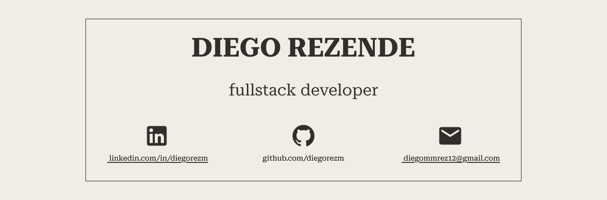

# 💫 About Me:

I am a Full Stack Developer from Brazil, currently studying Systems Analysis and Development.I have hands-on experience with Java and TypeScript, specializing in frameworks like Spring Boot and Next.js.

# 🔧 Tools I Built:

| name | description |
|--|--|
| [resumemk](https://github.com/diegorezm/resumemk.cli) | CLI tool for converting Markdown into a styled PDF resume |
| [wallpapercl](https://github.com/diegorezm/wallpapercl) | CLI tool to manage wallpapers, including a web server |
| [job_search](https://github.com/diegorezm/job-search) | CLI tool for tracking job applications, also includes a web server |

## 🌐 Socials:

 

# 💻 Tech Stack:

     

# 📊 GitHub Stats:

<!-- Proudly created with GPRM ( https://gprm.itsvg.in ) -->
